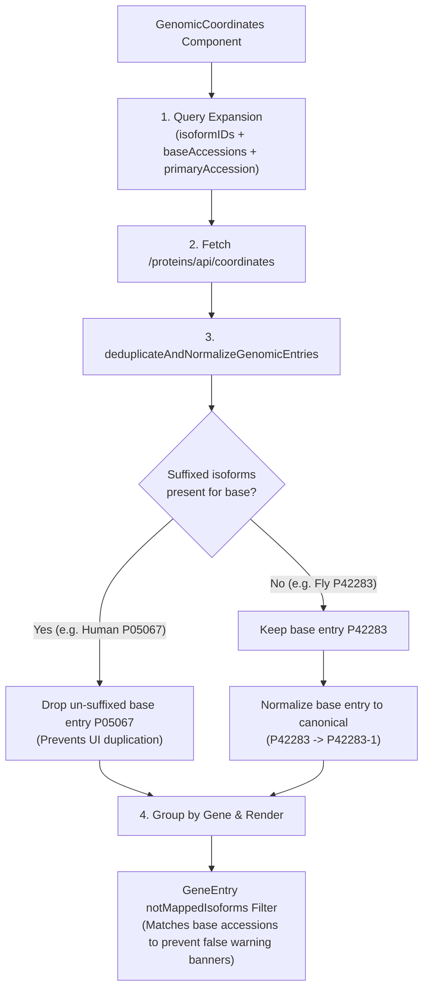

# Genomic Coordinates: Technical Rationale & Architecture Changes

This document explains why changes were made to the **Genomic Coordinates** tab, how the EBI Proteins API data structure behaves, and the design decisions behind the deduplication, normalization, and query expansion logic.

---

## 1. Problem Statement

Two related issues surfaced regarding genomic coordinates:

1. **Empty Mock and Test Failure**: Running `yarn run update-mocks` against `P42283.ts` resulted in `const mock: GenomicEntry[] = [];`, causing `utils.spec.ts` to crash (`TypeError: Cannot read properties of undefined (reading 'gnCoordinate')`).
2. **Missing UI Data for Non-Human Species**: In production, entries with alternative splicing from non-human model organisms (such as *Drosophila melanogaster* `P42283`) displayed:
   > *"No genomic coordinate information available for P42283"*
   even though coordinate data existed in the Proteins API.

---

## 2. Root Cause: Proteins API Data Indexing Differences

The EBI Proteins API (`GET /proteins/api/coordinates?accession=...`) aggregates coordinate data from multiple sources with differing indexing conventions:

| Source & Organisms | API Indexing Behavior | Example Accessions |
|---|---|---|
| **Ensembl (Human / Vertebrates)** | Maps coordinates directly to specific UniProt **isoform identifiers** | `P05067-1` (returns data)<br>`P05067` (returns data) |
| **Ensembl Genomes (Invertebrates / FlyBase, WormBase, etc.)** | Maps coordinates strictly to **canonical base accessions**, not hyphenated isoform IDs | `P42283` (returns data)<br>`P42283-1` (returns `[]`, 0 entries) |

### Why `GenomicCoordinates` Failed for Non-Human Entries
Previously, `GenomicCoordinates.tsx` queried only `isoformIDs`:
```ts
// If isoforms existed, only hyphenated IDs were queried:
isoformIDs = isoforms.flatMap((isoform) => isoform.isoformIds);
// Result for P42283: ['P42283-1', 'Q7KQZ4-2', 'Q7KQZ4-1', ...]
```
Because the Proteins API only indexes FlyBase coordinates under base accessions (`P42283`, `Q7KQZ4`, etc.), the API returned `[]` (empty array), causing the tab to display the *"No genomic coordinate information available"* message.

---

## 3. Risks & Side Effects of Simple Query Expansion

Querying both base accessions and isoform accessions (`accession=P05067,P05067-1`) introduces several UI side effects that required dedicated handling:

1. **Duplicate Cards in UI (Human Entries)**:
   For human entries like `P05067`, the API returns **both** `P05067` and `P05067-1` with identical coordinates. Without deduplication, users see duplicate cards/tables for the same sequence.

2. **Missing "Canonical" Badge & Bad Link IDs**:
   When the API returns `accession: "P42283"` without the `-1` suffix:
   - The check `canonical === accession` fails (`'P42283-1' === 'P42283'`), so the `<Chip compact>Canonical</Chip>` badge is not shown.
   - Header links render as `P42283` rather than `P42283-1`.

3. **Confusing "No Known Mapping" Warning Banner**:
   In `GeneEntry.tsx`, `notMappedIsoforms` checks which requested isoforms were not in the API response. If `isoformIDs` contains `P42283-1` and `Q7KQZ4-2`, but the API returns `P42283` and `Q7KQZ4`, the UI would display the coordinate table while simultaneously showing a warning banner claiming those isoforms have no mapping.

---

## 4. Architectural Solution

To support both human (isoform-specific) and non-human (canonical-only) entries seamlessly, a 4-step pipeline was implemented:



### Implementation Details

#### 1. Query Expansion (`GenomicCoordinates.tsx`)
Queries both isoform accessions and base accessions:
```ts
const baseAccessions = Array.from(
  new Set(isoformIDs.map((id) => id.split('-')[0]))
);
const accessionsToFetch = Array.from(
  new Set([...isoformIDs, ...baseAccessions, primaryAccession])
);

const { loading, data, progress, error, status } = useDataApi<GenomicEntry[]>(
  apiUrls.proteinsApi.coordinates(accessionsToFetch)
);
```

#### 2. Deduplication (`utils.ts`)
If a base accession has suffixed entries present in the response (e.g. `P05067-1` exists alongside `P05067`), the redundant un-suffixed entry is discarded.

#### 3. Normalization (`utils.ts`)
If only an un-suffixed entry is returned (e.g. `P42283`) and matches the displayed canonical base accession, its `accession` property is normalized to the canonical isoform identifier (`P42283-1`):
- Restores the `<Chip compact>Canonical</Chip>` badge.
- Links and headers properly identify the canonical isoform.

#### 4. Unmapped Isoforms Banner Alignment (`GeneEntry.tsx`)
`GeneEntry` checks whether an isoform or its base accession is mapped in the current gene card before adding it to `notMappedIsoforms`:
```ts
const notMappedIsoforms = isoformIDs.filter(
  (isoform) =>
    !mappedIsoforms.includes(isoform) &&
    !mappedIsoforms.includes(isoform.split('-')[0])
);
```

#### 5. Schema Extension (`types.ts`)
Extended `GenomicCoordinate` to include optional properties returned for non-Ensembl coordinates (such as FlyBase/RefSeq):
```ts
export type GenomicCoordinate = {
  genomicLocation: GenomicLocation;
  feature?: any;
  ensemblGeneId?: string;
  ensemblTranscriptId?: string;
  ensemblTranslationId?: string;
  refseqNucleotideId?: string;
  refseqProteinId?: string;
  nucleotideId?: string;
  proteinId?: string;
};
```

---

## 5. Summary of Files Modified

| File | Changes |
|---|---|
| [`src/uniprotkb/components/entry/tabs/genomic-coordinates/utils.ts`](file:///Users/dlrice/Developer/uniprot-website/b/src/uniprotkb/components/entry/tabs/genomic-coordinates/utils.ts) | Implemented `deduplicateAndNormalizeGenomicEntries`. |
| [`src/uniprotkb/components/entry/tabs/genomic-coordinates/GenomicCoordinates.tsx`](file:///Users/dlrice/Developer/uniprot-website/b/src/uniprotkb/components/entry/tabs/genomic-coordinates/GenomicCoordinates.tsx) | Expanded accessions query and added data preprocessing via `useMemo`. |
| [`src/uniprotkb/components/entry/tabs/genomic-coordinates/GeneEntry.tsx`](file:///Users/dlrice/Developer/uniprot-website/b/src/uniprotkb/components/entry/tabs/genomic-coordinates/GeneEntry.tsx) | Updated `notMappedIsoforms` to recognize base accession mappings. |
| [`src/uniprotkb/components/entry/tabs/genomic-coordinates/types.ts`](file:///Users/dlrice/Developer/uniprot-website/b/src/uniprotkb/components/entry/tabs/genomic-coordinates/types.ts) | Added non-Ensembl fields (`nucleotideId`, `proteinId`, `refseq*`) to `GenomicCoordinate`. |
| [`src/uniprotkb/components/entry/tabs/genomic-coordinates/__tests__/__mocks__/P42283.ts`](file:///Users/dlrice/Developer/uniprot-website/b/src/uniprotkb/components/entry/tabs/genomic-coordinates/__tests__/__mocks__/P42283.ts) | Updated `Source:` URL to canonical accessions and refreshed mock data. |
| [`src/uniprotkb/components/entry/tabs/genomic-coordinates/__tests__/utils.spec.ts`](file:///Users/dlrice/Developer/uniprot-website/b/src/uniprotkb/components/entry/tabs/genomic-coordinates/__tests__/utils.spec.ts) | Added unit tests for deduplication, normalization, and edge cases. |
